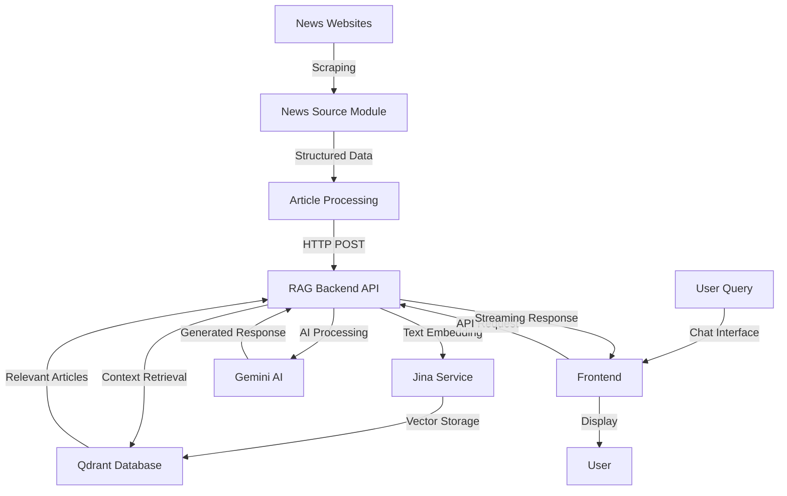

# 🤖 News RAG Chat Bot

A comprehensive AI-powered news chatbot system that combines real-time news scraping, vector search, and conversational AI to provide users with accurate, up-to-date news information through natural language conversations.

## 🌐 Live Demo

**🚀 Try the live application:**

- **Live Link:**: [https://news-rag-frontend-1.onrender.com/](https://news-rag-frontend-1.onrender.com/)

## 📂 Repositories

**📋 Source Code:**

- **Frontend Repository**: [https://github.com/Moneshwar/news_rag_frontend](https://github.com/Moneshwar/news_rag_frontend)
- **Backend Repository**: [https://github.com/Moneshwar/news_rag_backend](https://github.com/Moneshwar/news_rag_backend)
- **News Source Repository** [https://github.com/Moneshwar/news_source](https://github.com/Moneshwar/news_source)

## 🛠️ Tech Stack

### Frontend

- **React 22** with TypeScript
- **Vite** for build tooling
- **Tailwind CSS** for styling
- **Custom hooks** for state management

### Backend

- **Node.js** with Express.js
- **TypeScript** for type safety
- **Google Gemini AI** for response generation
- **Jina AI** for text embeddings
- **Qdrant** vector database
- **Redis** for caching and session management

### Infrastructure

- **Render** for hosting (both frontend and backend)
- **Qdrant Cloud** for vector storage
- **Redis Cloud** for caching

## 🎥 Demo Video

[Demo Video Link] - [_Video Link ](https://drive.google.com/file/d/1g_0QGbHM5-oKmQAm4ncM5q0EYhXmOMTt/view)

- Frontend startup and interface
- Sending queries and observing Gemini AI responses
- Viewing and resetting chat history of session
- End-to-end functionality demonstration

## 📖 Code Walkthrough

### End-to-End Flow Overview

#### 1. Embeddings Creation, Indexing & Storage

- **News Scraping**: Articles are scraped from The Guardian using sitemap-based crawling
- **Text Processing**: Article content is cleaned and structured with metadata
- **Embedding Generation**: Jina AI service converts text into high-dimensional vectors
- **Vector Storage**: Embeddings are indexed and stored in Qdrant vector database
- **Batch Processing**: Articles are processed in batches for efficiency

#### 2. Redis Caching & Session History

- **Session Management**: Each user session is tracked with unique identifiers
- **Conversation History**: Chat history is cached in Redis

#### 3. Frontend API/Socket Communication

- **RESTful API**: Frontend communicates with backend via HTTP endpoints
- **Streaming Responses**: Real-time response streaming for better user experience
- **Error Handling**: Comprehensive error states and retry mechanisms
- **State Management**: Custom React hooks manage chat state and history

#### 4. Design Decisions & Improvements

- **Microservices Architecture**: Separate services for scalability and maintainability
- **Vector Search**: Semantic similarity over keyword matching for better relevance
- **AI Classification**: Intelligent query routing to determine if news data is needed
- **Responsive Design**: Mobile-first approach with Tailwind CSS

**Potential Improvements:**

- WebSocket implementation for real-time updates
- Advanced caching strategies with cache warming
- Multi-source news aggregation
- User authentication and personalization
- Analytics and usage tracking

## 🏗️ System Architecture

The News RAG Chat Bot is built using a modern microservices architecture with three main components:

```
┌─────────────────────────────────────────────────────────────────────────────┐
│                           News RAG Chat Bot System                          │
├─────────────────────────────────────────────────────────────────────────────┤
│                                                                             │
│  ┌─────────────────┐    ┌─────────────────┐    ┌─────────────────────────┐  │
│  │   News Source   │    │  RAG Backend    │    │    Frontend Client      │  │
│  │                 │    │                 │    │                         │  │
│  │ • Web Scraping  │───▶│ • Vector Store  │◀───│ • React Chat Interface  │  │
│  │ • Data Pipeline │    │ • AI Processing │    │ • Real-time Updates     │  │
│  │ • Article Mgmt  │    │ • API Endpoints │    │ • Responsive Design     │  │
│  └─────────────────┘    └─────────────────┘    └─────────────────────────┘  │
│                                                                             │
└─────────────────────────────────────────────────────────────────────────────┘

                    ┌─────────────────────────────────┐
                    │        External Services        │
                    ├─────────────────────────────────┤
                    │ • Google Gemini AI              │
                    │ • Jina Embedding Service        │
                    │ • Qdrant Vector Database        │
                    │ • Redis Cache (Optional)        │
                    └─────────────────────────────────┘
```

## 🔧 Core Components

### 1. News Source (`news-source`)

**Purpose**: Automated news collection and data pipeline

- **Web Scraping**: Extracts articles from The Guardian using sitemap-based crawling
- **Data Processing**: Structures article content with metadata (title, content, authors, dates)
- **API Integration**: Posts processed articles to the RAG backend for vector storage
- **Rate Limiting**: Respectful scraping with configurable delays

### 2. RAG Backend (`rag-chatbot-backend`)

**Purpose**: Core AI processing and API services

- **Vector Search**: Semantic similarity search using Jina embeddings
- **AI Integration**: Google Gemini for intelligent response generation
- **Document Management**: Handles article ingestion and retrieval
- **Session Management**: Maintains conversation context and history
- **Caching**: Redis-based performance optimization

### 3. Frontend Client (`rag-chatbot-frontend`)

**Purpose**: User interface and interaction layer

- **Chat Interface**: Modern, responsive React-based UI
- **Real-time Updates**: Streaming responses with typing indicators
- **Session Persistence**: Maintains conversation history
- **Link Parsing**: Intelligent handling of URLs in responses

## 🚀 How It Works

### Data Flow Process



### Conversation Flow

1. **User Input**: User asks a news-related question through the chat interface
2. **Query Analysis**: Backend determines if the query requires news data using AI classification
3. **Vector Search**: If news data is needed, the system searches for relevant articles using semantic similarity
4. **Context Assembly**: Retrieved articles are combined with the user's question
5. **AI Generation**: Gemini AI generates a comprehensive response based on the context
6. **Response Delivery**: The answer is streamed back to the user with proper formatting and source links

## 🔄 System Workflow

### Query Processing Flow

1. **User Input**: User asks a news-related question through the chat interface
2. **Query Analysis**: Backend determines if the query requires news data using AI classification
3. **Vector Search**: If news data is needed, semantic similarity search retrieves relevant articles
4. **Context Assembly**: Retrieved articles are combined with the user's question
5. **AI Generation**: Gemini AI generates a comprehensive response based on the context
6. **Response Delivery**: The answer is streamed back to the user with proper formatting and source links

## 📊 Key Features

### 🔍 Intelligent News Search

- **Semantic Understanding**: Uses vector embeddings for meaning-based search
- **Context Awareness**: Maintains conversation history for better responses
- **Source Attribution**: Provides links to original news articles

### ⚡ Performance Optimizations

- **Caching**: Redis-based caching for frequently accessed data
- **Streaming Responses**: Real-time response generation for better UX

### 🎨 Modern User Interface

- **Responsive Design**: Works seamlessly across desktop and mobile
- **Real-time Updates**: Live typing indicators and streaming responses
- **Clean Aesthetics**: Modern design with Tailwind CSS

## 📄 License

This project is licensed under the ISC License.

## 🔗 External Services

- [Google Gemini AI](https://aistudio.google.com/)
- [Jina AI](https://jina.ai/)
- [Qdrant Vector Database](https://qdrant.tech/)
- [Render Hosting](https://render.com/)

---
